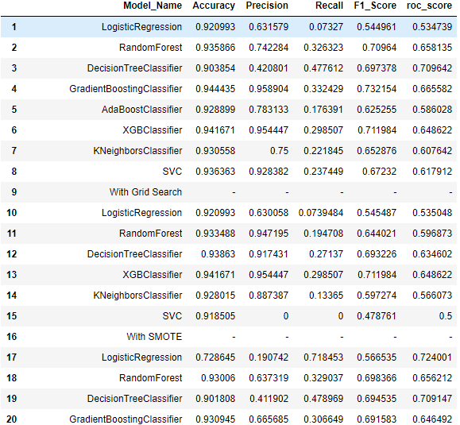

# HR-Analytics-Promotion

#### Predict the eligible candidates for Promotion

  

### INTRODUCTION
A large MNC and they have 9 broad verticals across the organisation. One of the problem my client is facing is around identifying the right people for promotion (only for manager position and below) and prepare them in time. Currently the process, they are following is:

They first identify a set of employees based on recommendations/ past performance Selected employees go through the separate training and evaluation program for each vertical. These programs are based on the required skill of each vertical At the end of the program, based on various factors such as training performance, KPI completion (only employees with KPIs completed greater than 60% are considered) etc., employee gets promotion For above mentioned process, the final promotions are only announced after the evaluation and this leads to delay in transition to their new roles. Hence, company needs your help in identifying the eligible candidates at a particular checkpoint so that they can expedite the entire promotion cycle.

### DATA

| Column Name          | Description                                                                                   |
| -------------        | -------------                                                                                 | 
| employee_id	         | Unique ID for employee                                                                        | 
| department	         | Department of employee                                                                        |  
| region               | Region of employment (unordered)                                                              | 
| education            | Education Level                                                                               |   
| gender               | Gender of employee                                                                            |
| recruitment_channel  | Channel of recruitment for employee                                                           |
| no_of_trainings	     | no of other trainings completed in previous year on soft skills, technical skills etc.        |
| age                  | Age of employee                                                                               |
| previous_year_rating | Employee Rating for the previous year                                                         |
| length_of_service    | Length of service in years                                                                    |
| KPIs_met >80%        | if Percent of KPIs(Key performance Indicators) >80% then 1 else 0                             |
| awards_won?          | if awards won during previous year then 1 else 0                                              |
| avg_training_score   | Average score in current training evaluations                                                 |
| is_promoted          | (Target) Recommended for promotion                                                            |         

### Describe what are those parameters:
- KPI - KPI is met > 80% - A boolean value telling us whether or not a given employee has met the KPI
- age - Age of a given employee
- avg_training_score - The average training score
- awards_won - boolean value, it has won or not
- department - 9 different departaments, categorical column
- education - categorical column
- gender - gonna change this categorical categorie, 0 female / 1 men
- is_promoted - boolean value, has it got a promotion or not?
- length_of_service - amount of time working for the company
- no_of_trainings - number of trainings
- previous_year_rating - rating given in the previous year, the higher the better
- recruitment_channel - categorical category
- region - different regions in this company

### Data preparation
- Missing values found in education and prev year rating
- Fill previous rating with mean prev ratings and education with mode value of education - group by promotion
- Gender categorie and Education is easily mapped into numerical ones
- Encode all categorical variables
- Transform Data using MinMaxScaler

  

### Exploratory Data Analysis
__Distribution of each columns__

- __Target Rate__

  
   The dataset is slightly imbalance, where it is having only 8.5% of category-Not Promoted. 

- __Numerical features__ 

  
   
  
   
  
   
  The age distribution is slighlty right skewed distribution, the peak of the distribution is 30 years
it would be a good idea to map age and create 4 differente values for it, according to the distribution above:
<=26 : 0 , > 27 < 35 : 1 , > 35 < 50, > 50
   
  Distribution of age after mapping
     
  

- __Correlation Heatmap__

  
   
We see again from the correlation heatmap that almost all the variables are not directly correlated with promotion rate.
The variables with the highest correlation (0.22 and 0.20 respectively) is whether the KPI is met and whether an award was won.  

- __Model Evaluation__

  
   
  
   
  

- __Find importance of features contributing to prediction__

  
   
  

### CONCLUSION
- Since data set is imbalanced, we preferred to use F1 score & Recall rather than accuracy to measure the Model

- The Model GradientBoostingClassifier with Under sample is providing good F1 & Recall Score, but the F1 Score reduced little bit when tested on non under sampled test data set

- The Model XGBClassifier without hyper parameters & Under sampling is providing better F1 Score 0.91581 and also better recall 0.824987 among all

- Either of above two models can be used for promotion prediction depending on business requirement 

- Top five features are KPI, awards_won, previous_year_rating, department and avg_training_score which contributes for prediction
